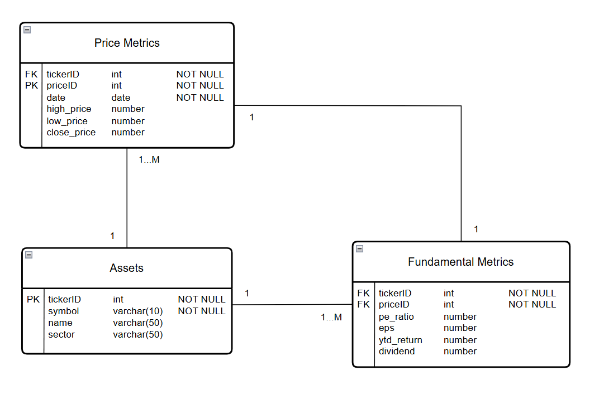

# YFinance Remote Ingestion Pipeline

A hybrid ETL (Extract, Transform, Load) pipeline that executes financial data extraction and transformation remotely via GitHub Actions and streams the transformed data down to a local Microsoft SQL Server Express instance. The entire process is automated through a single double-clickable Windows `.bat` script, allowing the user to update a ticker list within the pipeline's root directory and populate the local database without manually opening a terminal or managing Python environments.

```Text
[Local Machine]                                     [GitHub Actions Remote Runner]
  tickers.txt --------------------------------------> Trigger Workflow (gh CLI)
                                                                |
                                                        Fetch Data (yfinance)
                                                                |
                                                        Transform Records
                                                                |
  local MS SQL Server <--- Download Artifact <------ Save transformed_data.json
```

The local trigger: a `.bat` file launches Git Bash, reads target symbols from `ticker.txt` and uses the GitHub CLI to trigger remote workflow.

The remote cloud: GitHub Actions fetches market metrics via the yFinance API and cleans/structures the data into JSON matching the SQL database schema (found in data/)

Loading local system: The local runner downloads the generated JSON payload from GitHub artifacts and writes the formatted records into `localhost\SQLEXPRESS`

### Project Structure

```Text
YFINANCE-INGESTION-PIPELINE/
├── .github/
│   └── workflows/
│       └── run_etl.yml        # Remote GitHub Actions pipeline workflow
├── data/
│   ├── db_scripts/            # SQL creation and testing scripts
|   └── db_schema.png          # SQL database schema diagram
├── etl/
│   ├── __init__.py            # Package initializer[cite: 3]
│   ├── extract.py             # yfinance extraction logic[cite: 4]
│   ├── transform.py           # Data cleanup & JSON formatting[cite: 2]
│   └── load.py                # Lazy-loaded MS SQL Express connection & inserts
├── financeETL.bat             # Desktop launcher script
├── main.py                    # Entry point supporting CLI mode execution
├── README.md                  # Project documentation
├── requirements.txt           # Lightweight dependencies for remote GitHub runners
├── run_remote_etl.sh          # Git Bash orchestration script
└── tickers.txt                # Target stock ticker list
```

### Database Schema




